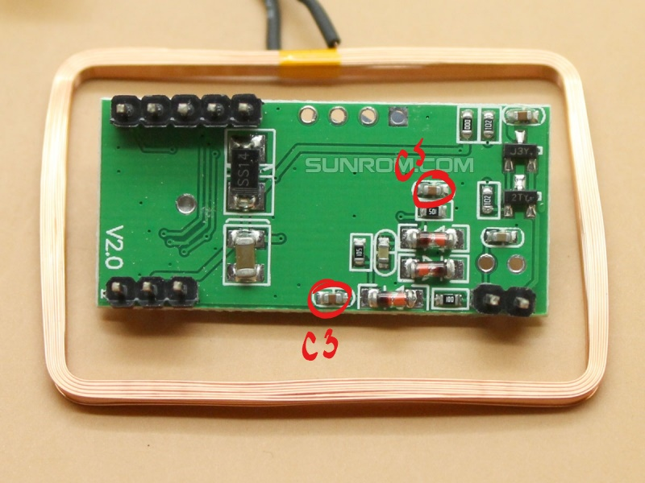

# hid-rfid-reader
A simple reader for HID RFID devices using a modified RDM6300 and a teensy 3.6

Find the RDM6300 Schematic [here](http://www.sunrom.com/get/171800).

## RDM6300 Modification
The capacitors C3 and C5 can be changed to 330 pf to allow the 15.625 kHz signal through.

